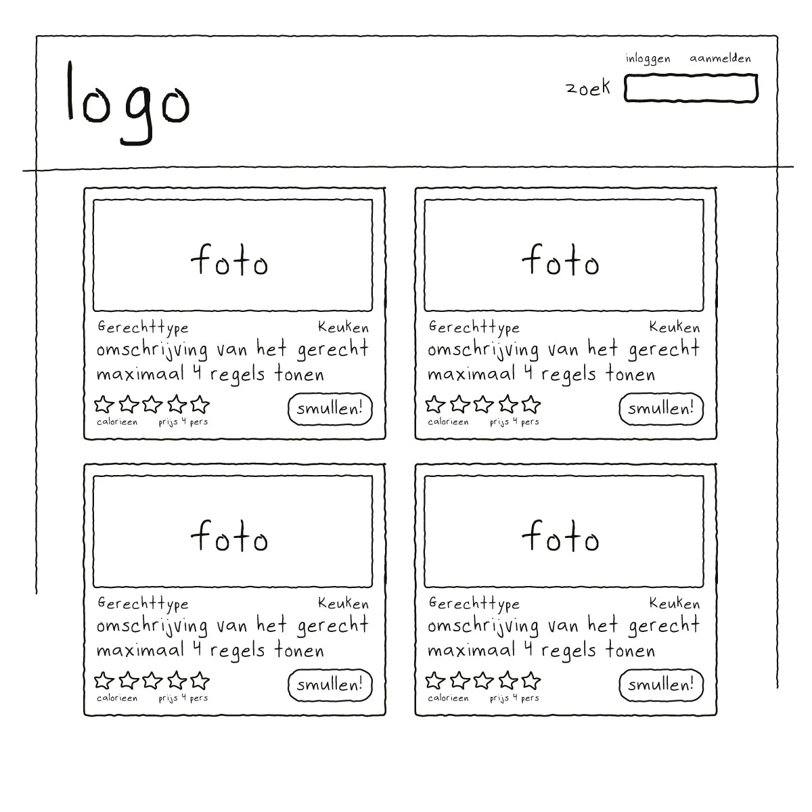
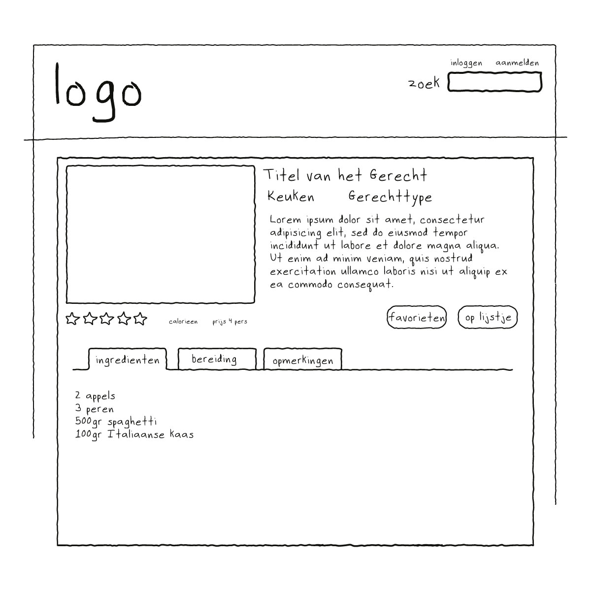

# Verrukkuluk 
Gegeven is een recepten website die door een grote supermarktketen als extra service- en verkoopkanaal wordt ingezet. Alle artikelen die in de recepten gebruikt worden, zijn in
de filialen van de supermarkt te verkrijgen.

## Doel van de site
De bedoeling is dat bezoekers van de site zelf recepten kunnen toevoegen en van de gekozen recepten
een boodschappenlijstje kunnen samenstellen.
De site berekent automatisch het aantal calorieën per recept op basis van de artikel informatie en de benodigde hoeveelheden. De bezoekers van de site kunnen recepten (anoniem) waarderen (1 t/m 5 sterren), en er kan door de bezoekers op recepten gereageerd
worden (daarvoor dient men ingelogd te zijn).

## Layout
Een vormgever heeft een zgn. “mock-up” van de site gemaakt, en het eerste ontwerp is een “werkopzet” en kan gebruikt
worden voor ontwikkeling.

### Homepage


### Detailpagina



## De homepage
Op de home page staan initieel een lijst van alle recepten, aflopend gesorteerd op basis van de datum dat het recept werd
toegevoegd.

#### Detailblok
Per gerecht wordt een detailblok getoond. In dit blok wordt een foto van het gerecht getoond. Hieronder staat het gerecht type (Vlees, Vis, Vegetarisch, etc) en de keuken (Italiaans, Frans, Indonesisch etc). Vervolgens over de hele breedte de titel van het gerecht en een korte omschrijving (max 4 regels). Linksonder staat het aantal sterren dan een gerecht ontvangen heeft, het aantal calorieën en de prijs per 4 personen. De knop “Smullen” linkt door naar de pagina met de
ingrediënten, de stappen en de opmerkingen van bezoekers.

## Het Detailscherm
Op het detailscherm van het gerecht staan een aantal blokken met diverse informatie:
1. Het hoofdblok: hierin staat de titel van het gerecht, een
omschrijving, tot welke keuken het behoort en het type van het gerecht. Ook staat hier de voornaam van degene die het toegevoegd heeft en de datum van toevoeging.
2. De sterren en calorieen en prijs voor 4 personen worden hier ook weer genoemd.
3. Middels een knop kan het gerecht aan de favorieten worden toegevoegd Middels een andere knop kan het gerecht aan het boodschappenlijstje worden toegevoegd.
4. Een drietal tabbladen laten respectievelijk de ingrediënten, de bereiding en eventuele opmerkingen van bezoekers zien. Om opmerkingen toe te kunnen voegen, dient men ingelogd te zijn.

## Opdracht
Vervaardig een gegevensmodel op basis van bovenstaande informatie en scherm-mockups in twee fases: 
1. Fase 1: De back-end
2. Fase 2: De front-end

> Hanteer de planning in je project-overzicht

## Fase 1 - De Back-end
In deze fase programeer je alles wat met het ophalen van de gerechten te maken
heeft, ook het maken en het bijwerken van de boodschappenlijst en de favorieten ga je nu vervaardigen.


## Fase 2 - De front-end

De startup-code van **Fase 2** vind je in de <a href='./fase-2/'>Fase 2 directory</a>

Aangezien er in de moderne tijd nog zelden zonder framework gewerkt wordt - 
zowel voor frontend development of backend ontwikkeling - gaan we in deze case 
ook alvast aan de slag met een zogenaamde [template engine](https://en.wikipedia.org/wiki/Template_processor). 
Dit is een stukje code dat ontwikkeld is om het leven van een developer wat 
aangenamer te maken. 

Open je command line interface. in windows start je deze door: 

`Start -> Uivoeren -> cmd`

Mogelijk dat je je zogenaamde [PATH moet instellen](https://www.computerhope.com/issues/ch000549.htm).
We gaan hier nu niet uitleggen wat dat precies betekent, 
in dit geval is [Google](https://www.google.com/search?ei=mKaiXovxO8eykwXxjJDYDQ&q=what+is+the+path+in+dos+or+windows+10&oq=what+is+the+PATH+in+dos+or+windo&gs_lcp=CgZwc3ktYWIQAxgBMggIIRAWEB0QHjIICCEQFhAdEB4yCAghEBYQHRAeMggIIRAWEB0QHjIICCEQFhAdEB4yCAghEBYQHRAeMggIIRAWEB0QHjoECAAQRzoECAAQQzoCCAA6BQgAEJECOgYIABAWEB5QwBZYq2JgoWtoA3AGeACAAWeIAZMSkgEEMzQuMZgBAKABAaoBB2d3cy13aXo&sclient=psy-ab) your friend.

### Twig
De template engine die we nu gaan gebruiken is [twig](https://twig.symfony.com). 
Deze gaan we in het Symfony  project (Symfony) ook inzetten.
Er zijn nog wel een aantal, zoals bijvoorbeeld [Smarty](https://www.smarty.net/) 
maar die werkt in grote lijnen hetzelfde.  

Je kunt twig nu via composer toevoegen aan de je project. 
Open hier toe een command prompt en type de volgende commando's:

### Windows
```shell
cd \directory\van\project [ENTER\
```

### Mac / Linux
```shell
cd directory/van/project [ENTER]
```

**NB:** `directory/van/project` moet je uiteraard vervangen door de **ECHTE** naam(en) van
de directory's van je project...

Installeer nu vanuit deze directory (de "root" van je project) twig met composer: 

```shell
composer require twig/twig
```

Eventueel:
```shell
php composer require twig/twig
```

### Project
Dit "skeleton" project is een eenvoudige instructie hoe je met twig kunt werken. 
Kijk voor meer informatie en uitgebreide documentatie op de [twig site](https://twig.symfony.com)
  
### UPDATE JUNI 2020
Bootstrap 4 toegevoegd en JQuery 3.5.1, verder "klaar" gemaakt voor het gebruik binnen de Verrukkuluk! Case. Maak gebruik van https://layoutit.com om je pagina's verder in te vullen.


